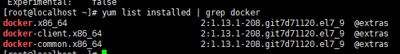
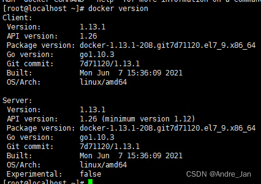
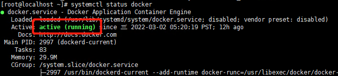
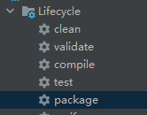
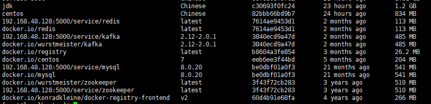
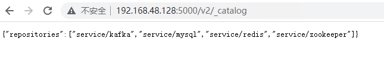

# centos7 部署springboot项目

## 1.安装docker

 1. 先查看虚拟机上是否已安装docker： `yum list installed | grep docker`	 



    2. 安装docker镜像：			`yum -y install docker`
  3. 成功后查看安装后的docker版本：   `docker version`
     
        4. 启动docker：    `systemctl start docker` 
  5. 查看docker运行状态：  `systemctl status docker`
     	active为running 即代表docker已经启动
        6. 设置docker开机启动：  `systemctl enable docker`

到这里docker基本已经安装完成
需要注意的点：
使用官方源地址可能比较慢，我们可以使用国内的镜像如阿里云和清华大学源

 - 阿里云：
```
	yum-config-manager \
    --add-repo \
    http://mirrors.aliyun.com/docker-ce/linux/centos/docker-ce.repo
```
 - 清华大学源
```
	yum-config-manager \
    --add-repo \
    https://mirrors.tuna.tsinghua.edu.cn/docker-ce/linux/centos/docker-ce.repo
```

## 2.构建springboot项目所需镜像至docker

 1. 通过IDEA的maven插件 将maven项目进行打包，得到项目的jar包，先 clean 后 package

 2. 将jar包上传到虚拟机某一目录
 3. 在jar包所在目录创建Dockerfile文件，打包镜像
	```
	FROM jdk  									#定制的镜像都是基于 FROM 的镜像
	MAINTAINER andre    						#镜像维护者姓名或邮箱地址
	VOLUME /code/service  						#指定容器挂载点到宿主机自动生成的目录或其他容器
	ADD service.jar  /service.jar    			#拷贝文件或目录到容器中，如果是URL或压缩包便会自动下载或自动解压
	EXPOSE 8001  								#帮助镜像使用者理解这个镜像服务的守护端口，以方便配置映射
	ENTRYPOINT ["java","-jar","/service.jar"]  	# 运行容器时执行的shell命令
	```
	> Dockerfile  部分相关指令说明
	> FROM：构建镜像基于哪个镜像
	> MAINTAINER: 	镜像维护者姓名或邮箱地址
	> RUN：构建镜像时运行的指令
	> CMD：运行容器时执行的shell环境
	> VOLUME：指定容器挂载点到宿主机自动生成的目录或其他容器
	> USER：	为RUN、CMD、和 ENTRYPOINT 执行命令指定运行用户
	> WORKDIR：为 RUN、CMD、ENTRYPOINT、COPY 和 ADD 设置工作目录，就是切换目录
	> HEALTHCHECH：健康检查
	> ARG：构建时指定的一些参数
	> EXPOSE：声明容器的服务端口（仅仅是声明）
	> ENV：设置容器环境变量
	> ADD：拷贝文件或目录到容器中，如果是URL或压缩包便会自动下载或自动解压
	> COPY：拷贝文件或目录到容器中，跟ADD类似，但不具备自动下载或解压的功能
	> ENTRYPOINT：运行容器时执行的shell命令

4.创建好Dockerfile文件后在当前目录下使用命令：		`docker build -t  <镜像名> .`		构建镜像
如：`docker build -t service .`
到此从构建镜像步骤已

## 3.根据需要搭建docker私服（可选）

 1. 拉取docker registry镜像
	`docker pull registry  `
 2. 指定参数创建registry容器
	```
	docker run -d \
	-p 5000:5000 \     #映射端口为5000
	--restart=always \  #设置是否总是启动
	--name registry \   #为容器取名为registry
	-v /home/docker_image_repo:/var/lib/registry \  #将上传的镜像放到本地的 /home/docker_image_repo 目录
	--privileged=true \  #设置权限
	registry   #构建容器所需镜像名
	```
 3. 启动成功后，使用命令`vim  /etc/docker/daemon.json`修改客户端docker的配置

```bash
加入以下内容:
{
	"registry-mirrors": [ "https://pee6w651.mirror.aliyuncs.com"],
	"insecure-registries": ["192.168.179.128:5000"]   #这里是虚拟机本机的ip地址加5000端口号，仓库的默认端口号是5000
}

> 	**"registry-mirrors": ["https://pee6w651.mirror.aliyuncs.com"]是阿里云代理的Registry Hub仓库的地址，可以加快国内访问Registry Hub仓库的速度。也可使用其他的代理仓库**
> 	**"insecure-registries":是registry的代理服务地址，192.168.179.128应替换为本机ip**
```
 4. 修改好之后需要重启Docker服务才能生效，执行重启docker命令：

```bash
`systemctl restart docker`
```

## 4.上传镜像至私服

 1. 使用命令： `docker images` ，查看docker中的已有镜像	

2.使用命令为镜像打tag：`docker tag 	<本地镜像名> 		<ip地址：端口号>/<仓库中起的镜像名>:<版本号 > `
	例： 想将本地的redis镜像上传到仓库，如果镜像的版本为latest则可以不填：
			`docker  tag  redis  192.168.48.128:5000/redis`
3.将镜像上传到仓库：`docker push <ip地址：端口号>/<仓库中起的镜像名>：<版本号 >`
	例：将上面打好tag的redis镜像上传到仓库：
		`docker  push 192.168.48.128:5000/redis`
 4.上传完成之后可通过浏览器访问`http:// <ip地址：端口号>/v2/_catalog`
例：在浏览器中输入  `http://192.168.48.128:5000/v2/_catalog`

## 5.部署项目的dockercompose文件
docker-compose.yml
```
version: '2' # 表示该 Docker-Compose 文件使用的是 Version 2 file
services:
  zookeeper: # 指定服务名
    image: 192.168.48.128:5000/service/zookeeper #镜像所在私服位置 
    #image: zookeeper    #如果没有私服仓库也可直接引用本地镜像
    container_name: zookeeper   #设置容器名
    hostname: zookeeper  #设置容器中的主机名
    ports: # 指定端口映射
      - "2181:2181"
    expose:  #选择暴露的端口
      - 2181
    networks:  #选择想要服务所处的网段
      - community  #可以是在下面进行定义 也可使用系统本身已存在的网段

  kafka: # 指定服务名
    image: 192.168.48.128:5000/service/kafka:2.12-2.0.1
    container_name: kafka
    hostname: kafka
    ports: # 指定端口映射
      - "9092:9092"
    expose:
      - 9092
    environment:
      KAFKA_ADVERTISED_LISTENERS: PLAINTEXT://kafka:9092
      KAFKA_ADVERTISED_PORT: 9092
      KAFKA_LISTENERS: PLAINTEXT://0.0.0.0:9092
      KAFKA_ZOOKEEPER_CONNECT: zookeeper:2181
    networks:
      - community

  mysql:
    image: 192.168.48.128:5000/service/mysql:8.0.20
    container_name: mysql
    hostname: mysql
    #端口号
    ports:
      - "3306:3306"
    expose:
      - 3306
    depends_on: #设置启动顺序，填写的服务都会在该服务之前启动
    #这里设置的是 在redis启动之后 进行启动
      - redis
    #环境变量
    environment:
      MYSQL_ROOT_PASSWORD: root
      TZ: Asia/Shanghai
    #挂载文件     主机挂载目录：容器目录
    volumes:
      - ./mysql/init:/docker-entrypoint-initdb.d/
      - ./mysql/conf:/etc/mysql
      - ./mysql/data:/var/lib/mysql
      - ./mysql/log:/var/log/mysql
    command: [      #命令行,设置docker启动参数 
        '--character-set-server=utf8mb4',
        '--collation-server=utf8mb4_unicode_ci',
        '--lower_case_table_names=1',  #设置虚拟机不区分大小写
        '--max_allowed_packet=900M',  #客户端在一次传送数据包的过程当中最大允许的数据包大小
        '--default-authentication-plugin=mysql_native_password' #这行代码解决mysql无法访问的问题
    ]
    networks:
      - community

  redis: # 指定服务名
    image: 192.168.48.128:5000/service/redis
    container_name: redis
    hostname: redis
    ports: # 指定端口映射
      - "6379:6379"
    expose:
      - 6379
    networks:
      - community

  eureka: # 指定服务名
    image: 192.168.480128:5000/eureka
    container_name: eureka
    hostname: eureka
    ports: # 指定端口映射
      - "8761:8761"
    expose:
      - 8761
    networks:
      - community
    depends_on:
      - mysql
      - redis
      - kafka
      - zookeeper
    environment:
      - MAX_MEM:-Xmx256m #设置最大内存
      - MIN_MEM:-Xms256m  #设置最小内存

  community_user: # 指定服务名
    image: 192.168.48.128:5000/service-user
    ports: # 指定端口映射
      - "8002:8002"
    expose:
      - 8002
    networks:
      - community
    environment:
      - MAX_MEM:-Xmx256m
      - MIN_MEM:-Xms256
    depends_on:
      - mysql
      - redis
      - eureka

networks:   #设置网段
  community:   #指定网段名称
    driver: bridge   #创建 桥接 网络
    ipam:
      config:
        - subnet: 192.168.50.0/24  #设置子网掩码
          gateway: 192.168.50.1  #设置网关

```
构件好docker-compose.yml文件之后，就可以使用命令
`docker-compsoe up`
在docker-compose.yml文件所在目录下 将里边的景象部署到docker中 。

如果要删除docker-compose中的所有容器以及网段，在yml所在目录下执行`docker-compsoe down`即可 

 ## 6.部署项目到docker可能存在的问题

 - **docker.sock 权限问题**  执行下面两个命令 
	```
	cd /var/run  
	sudo chmod 777 docker.sock
	```
	
 - **docker 启动mysql权限问题**

   ```
   方法一：暂时关闭  重启服务器就失效
   		使用命令  setenforce 0    
   		然后使用   getenforce   查看权限状态
   方法二：永久关闭
   		修改/etc/selinux/config 文件
   		将  SELINUX=enforcing   改为  SELINUX=disabled
   		修改配置文件需要重启机器，
   ```

 - **因防火墙问题造成无法通讯**
	
	```
	linux查看防火墙		systemctl status firewalld
	linux关闭防火墙		systemctl disable firewalld
	```
	
 - 修改linux乱码问题：安装centos7时设置中文编码

  ```bash
  FROM centos:7
  # 设置centos中文
  ENV LANG=zh_CN.UTF-8 \
      LANGUAGE=zh_CN:zh \
      LC_ALL=zh_CN.UTF-8
  
  # Install tools
  RUN yum update -y && \
      yum reinstall -y glibc-common && \
      yum install -y telnet net-tools && \
      yum clean all && \
      rm -rf /tmp/* rm -rf /var/cache/yum/* && \
      localedef -c -f UTF-8 -i zh_CN zh_CN.UTF-8 && \
      ln -sf /usr/share/zoneinfo/Asia/Shanghai /etc/localtime
  
  # Define default command.
  CMD ["bash"]
  ```

  